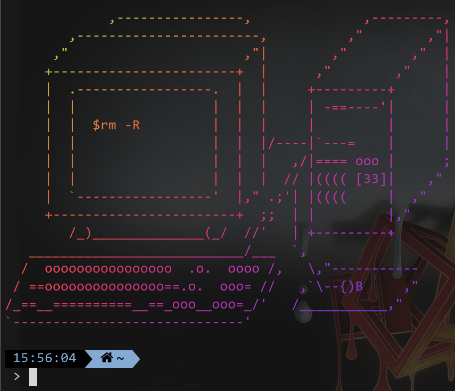

# ASCII Art Collection

A collection of ascii art which can be used in .bashrc

## Reference

https://github.com/DanCRichards/ASCII-Art-Splash-Screen

I found this good repo contains ascii art text files and a python code which random get a ascii art.

## Shell script tutorial

Since I found I can use shell script to get a random number, I don't need to use python code anymore.

Here's the code

```sh
# Since I only have 132 pictures now, we mod 132.
R=$[$RANDOM % 132]
curl -s "https://raw.githubusercontent.com/Griiid/ascii-art-collection/master/arts/$R.txt"
```

## Rainbow colors in the example image

You can use [lolcat](https://github.com/busyloop/lolcat) to make text colorful.

```sh
# Since I only have 132 pictures now, we mod 132.
R=$[$RANDOM % 132]
curl -s "https://raw.githubusercontent.com/Griiid/ascii-art-collection/master/arts/$R.txt" | lolcat
```

Created by Griiid 2022. 
